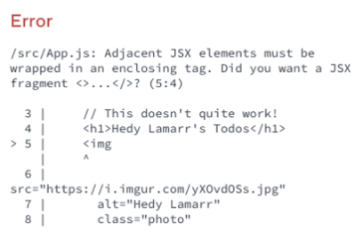
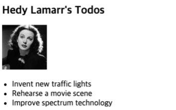
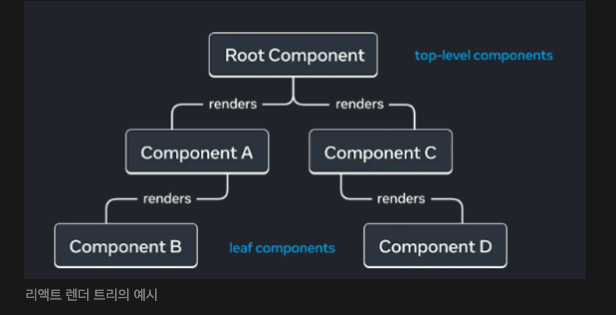
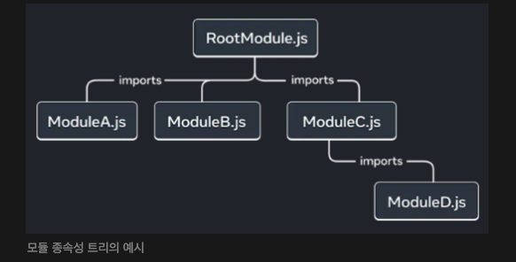

# Describing the UI  
  
리액트는 유저 인터페이스를 렌더링 하기위한 라이브러리 입니다.  

UI는 버튼, 텍스트 그리고 이미지 같은 작은 단위들로 구성됩니다.  

리액트는 당신이 UI의 작은 단위들을 재사용 가능하고   

중첩이 가능한 구성요소들로 결합할 수 있게 해줍니다.  

웹사이트 부터 핸드폰 어플까지 스크린상에 보이는 모든 요소들은 구성요소로 나뉠 수 있습니다.  

이번 챕터에서는,   

리액트 컴포넌트(구성요소)들을 만들거나, 커스터마이징 하거나 조건부로 보이게하는 것들을 배울겁니다.  
  
    
## 이번 챕터에서 배울것들
  
- 첫번째 리액트 컴포넌트를 작성하는 방법
- 멀티 컴포넌트 파일들을 만드는 방법과 시기
- JSX로 자바스크립트에 마크업을 추가하는 방법
- JSX에서 중괄호를 사용해서 컴포넌트의 자바스크립트 기능에 접근하는 방법
- props를 사용해서 컴포넌트를 구성하는 방법
- 컴포넌트들을 조건부로 렌더링 하는 방법
- 한번에 다수의 컴포넌트들을 렌더링 하는 방법
- 컴포넌트들을 순수하게 유지하면서 혼란스러운 버그를 피하는 방법
- UI 를 트리로써 이해하는것이 유용한 이유

### 첫 컴포넌트  

리액트 어플리케이션은  컴포넌트라고 불리는 독립적인 UI 조각들로 구성돼있습니다.  

리액트 컴포넌트들은 마크업을 끼얹을 수 있는 자바스크립트 함수 입니다.  

컴포넌트들은 작은 버튼이 될 수도 있고, 혹은 큰 전체적인 페이지가 될 수도 있습니다.   

다음은 세개의 Profile 컴포넌트들을 렌더링 하고 있는 Gallery 컴포넌트 입니다.  

```jsx
function Profile() {
  return (
    
  );
}

export default function Gallery() {
  return (
    <section>
      <h1>Amazing scientists</h1>
      <Profile />
      <Profile />
      <Profile />
    </section>
  );
}

```


## 컴포넌트들을 가져오고 내보내기  
  
한 파일에 많은 컴포넌트들을 선언할 수 있지만, 큰 파일들은 탐색하기 어려울 수 있다.  

이 문제를 해결하기 위해, 파일 자체에서 컴포넌트를 내보낼 수 있고,  

다른 파일로부터 그 컴포넌트를 가져올 수 있다.  

```jsx
import Profile from './Profile.js';

export default function Gallery() {
  return (
    <section>
      <h1>Amazing scientists</h1>
      <Profile />
      <Profile />
      <Profile />
    </section>
  );
}
```


## JSX를 사용해서 마크업 작성하기  

각각의 리액트 컴포넌트는 리액트가 브라우저에 렌더링해주는   

몇몇 마크업들을 포함하고 있는 자바스크립트 함수이다.  

리액트 컴포넌트들은 JSX 라는 구문확장을 사용해서 해당 마크업을 나타낸다.  

JSX는 HTML과 매우 유사하지만 더 엄격하고 동적 정보들을 보여줄 수 있다.  

만약에 한 리액트 컴포넌트안에 기존 HTML 마크업을 붙여넣는다면, 동작하지 않을거다.  

```jsx
export default function TodoList() {
  return (
    // This doesn't quite work!
    <h1>Hedy Lamarr's Todos</h1>
    
    <ul>
      <li>Invent new traffic lights
      <li>Rehearse a movie scene
      <li>Improve spectrum technology
    </ul>
  );
}
```



이와 같이 기존 HTML 이 있는경우, 컨버터를 사용해서 수정할 수 있다. (Fragment 를 사용)  

```jsx
export default function TodoList() {
  return (
    <>
      <h1>Hedy Lamarr's Todos</h1>
      
      <ul>
        <li>Invent new traffic lights</li>
        <li>Rehearse a movie scene</li>
        <li>Improve spectrum technology</li>
      </ul>
    </>
  );
}

```



## 중괄호가 있는 JSX의 자바스크립트  

JSX는 자바스크립트 파일 안에서 HTML 과 같은 마크업을 작성할 수 있게 해주면서,  

같은 위치에 콘텐츠와 렌더링 로직을 유지하게 해준다.  

때로는 약간의 자바스크립트 로직을 추가하거나  해당 마크업 안에서 동적 요소를 참조하고 싶을 거다.  

그러한 상황에서 JSX에서 중괄호를 사용해서 javascript로 윈도우를 오픈 할 수 있다.  

```jsx
 const person = {
  name: 'Gregorio Y. Zara',
  theme: {
    backgroundColor: 'black',
    color: 'pink'
  }
};

export default function TodoList() {
  return (
    <div style={person.theme}>
      <h1>{person.name}'s Todos</h1>
      
      <ul>
        <li>Improve the videophone</li>
        <li>Prepare aeronautics lectures</li>
        <li>Work on the alcohol-fuelled engine</li>
      </ul>
    </div>
  );
}

```


## Props를 컴포넌트에 전달하기  

리액트 컴포넌트들은 props 를 사용해서 서로 통신한다.  

모든 부모 컴포넌트는 props를 자식 컴포넌트들에게 제공해서 정보를 전달한다.  

props 는 HTML 요소들을 연상시킬 수 있지만,  

props를 통해서 객체, 배열, 함수 그리고 심지어 JSX를 포함한 모든 자바스크립트 값들을 전달해줄 수  있다.  

```jsx
// App.js

import { getImageUrl } from './utils.js'

export default function Profile() {
  return (
    <Card>
      <Avatar
        size={100}
        person={{
          name: 'Katsuko Saruhashi',
          imageId: 'YfeOqp2'
        }}
      />
    </Card>
  );
}

function Avatar({ person, size }) {
  return (
    
  );
}

function Card({ children }) {
  return (
    <div className="card">
      {children}
    </div>
  );
}

```

```jsx
// utils.js

export function getImageUrl(person, size = 's') {
  return (
    'https://i.imgur.com/' +
    person.imageId +
    size +
    '.jpg'
  );
}

```  


## 조건부 렌더링  

컴포넌트들은 다양한 조건에 따라 다른 내용들을 표시해야하는 경우가 있다.  

리액트에서 if문, && , ? : 연산자와 같은 자바스크립트 문법을 사용해서 조건부로 JSX를 렌더링 할 수 있다.  

이 예제에서, && 연산자를 사용해서 체크표시를 조건부로 렌더링한다.  

```jsx
function Item({ name, isPacked }) {
  return (
    <li className="item">
      {name} {isPacked && '✔'}
    </li>
  );
}

export default function PackingList() {
  return (
    <section>
      <h1>Sally Ride's Packing List</h1>
      <ul>
        <Item
          isPacked={true}
          name="Space suit"
        />
        <Item
          isPacked={true}
          name="Helmet with a golden leaf"
        />
        <Item
          isPacked={false}
          name="Photo of Tam"
        />
      </ul>
    </section>
  );
}

```


## 렌더링 목록들  

데이터 집합에서 여러 유사한 컴포넌트들을 표시하려는 경우가 있다.  

자바스크립트의 filter() 와 map() 와 리액트를 사용해서   

컴포넌트의 배열에서 데이터 배열을 필터링 하거나 컴포넌트 배열을 변형 할 수 있다.  

각각의 배열 항목에 있어서 키를 지정해야한다.  

보통 데이터베이스의 ID를 키로 사용한다.  

key들은 목록이 변경되더라도 react 가 목록에서 각 항목의 위치를 추적할 수 있게 해준다.  

```jsx
// App.js
import { people } from './data.js';
import { getImageUrl } from './utils.js';

export default function List() {
  const listItems = people.map(person =>
    <li key={person.id}>
      
      <p>
        <b>{person.name}:</b>
        {' ' + person.profession + ' '}
        known for {person.accomplishment}
      </p>
    </li>
  );
  return (
    <article>
      <h1>Scientists</h1>
      <ul>{listItems}</ul>
    </article>
  );
}

// data.js
export const people = [{
  id: 0,
  name: 'Creola Katherine Johnson',
  profession: 'mathematician',
  accomplishment: 'spaceflight calculations',
  imageId: 'MK3eW3A'
}, {
  id: 1,
  name: 'Mario José Molina-Pasquel Henríquez',
  profession: 'chemist',
  accomplishment: 'discovery of Arctic ozone hole',
  imageId: 'mynHUSa'
}, {
  id: 2,
  name: 'Mohammad Abdus Salam',
  profession: 'physicist',
  accomplishment: 'electromagnetism theory',
  imageId: 'bE7W1ji'
}, {
  id: 3,
  name: 'Percy Lavon Julian',
  profession: 'chemist',
  accomplishment: 'pioneering cortisone drugs, steroids and birth control pills',
  imageId: 'IOjWm71'
}, {
  id: 4,
  name: 'Subrahmanyan Chandrasekhar',
  profession: 'astrophysicist',
  accomplishment: 'white dwarf star mass calculations',
  imageId: 'lrWQx8l'
}];

//utils.js
export function getImageUrl(person) {
  return (
    'https://i.imgur.com/' +
    person.imageId +
    's.jpg'
  );
}

```

## 순수 컴포넌트들 유지하기  

일부 javascript 함수들은 순수하다.   

순수 함수 란?  

- 자신의 것만 생각한다. 호출되기전에 기존의 모든 객체나 변수들을 바꾸지 않는다.  
- 동일한 입력, 동일한 출력. 동일한 입력이 주어지면 순수함수는 항상 동일한 결과를 반환해야 한다.  

엄격하게 순수함수로 컴포넌트들을 작성함으로써,  

코드 베이스가 커짐에 따라 황당한 버그와 예측할 수 없는 동작의 전체 클래스를 피할 수 있다.  
  
다음은 순수하지 않은 컴포넌트 예시이다.  

```jsx
let guest = 0;

function Cup() {
  // Bad: changing a preexisting variable!
  guest = guest + 1;
  return <h2>Tea cup for guest #{guest}</h2>;
}

export default function TeaSet() {
  return (
    <>
      <Cup />
      <Cup />
      <Cup />
    </>
  );
```


기존 변수를 수정하는 것 대신에 prop을 전달함으로써 순수 컴포넌트를 만들 수 있습니다.  

```jsx
function Cup({ guest }) {
  return <h2>Tea cup for guest #{guest}</h2>;
}

export default function TeaSet() {
  return (
    <>
      <Cup guest={1} />
      <Cup guest={2} />
      <Cup guest={3} />
    </>
  );
}

```  


## Tree로써의 UI  

리액트는 컴포넌트와 모듈 사이의 관계들을 모델링 해주는 tree들을 사용한다.  

리액트 렌더 트리는 컴포넌트들 간의 부모와 자식 관계를 나타냅니다.  



  

트리 상단 근처, 루트 구성요소 근처에 있는 구성요소들은 상위 컴포넌트로 여겨진다.  

자식 요소가 없는 컴포넌트들은 leaf 컴포넌트 (가장 하단에 위치한 컴포넌트) 들이다.  

컴포넌트들의 카테고리화는 데이터 흐름과 렌더링 성능을 이해하는데에 유용하다.  

자바스크립트 모듈간의 관계를 모델링하는 것은 어플리케이션을 이해하는 또 다른 유용한 방법이다.  

이것를 모듈 종속성 트리 라고 부른다.  




종속성 트리는 클라이언트가 다운로드하고 렌더링 할 수 있도록 모든 관련된 javascript 코드를 번들하기위해   

빌드 도구에서 자주 사용됩니다.  

큰 번들 사이즈는 리액트 앱에 있어 사용자 경험이 저하된다.  

모듈 종속성 트리를 이해하는 것은 이러한 이슈를 디버깅 하는데에 유용하다.  